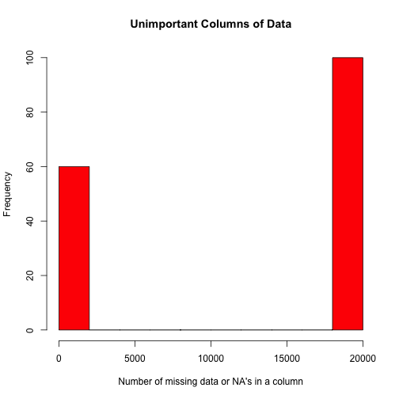
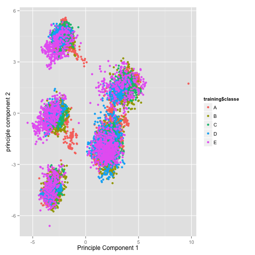
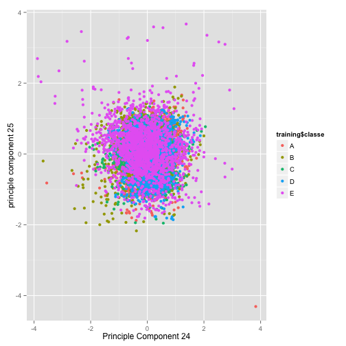

# Human Activity Recognition

## Synopsis

This document presents an approach for using data from various sensors attached to a weight lifter to predict if  the weight lifting is done properly. Six subjects are asked to perform ten repetitions of the Unilateral Dumbbell Biceps Curl in five different ways. The various approaches to lifting are classified as: A, B, C, D, and E. The correct lifing according to specification is labled A, throwing the elbows to the front is labled B, lifting the dumbbell only halfway is labled C, lowering the dumbbell only halfway is labled,  and finally throwing the hips to the front is labled B. Our objective is to build a predicitve model using the provided data to classify a particular weight lifting incident into one of the 5 possible classification.

## Loading and preprocessing the data
The data is directly read from the web site provided to us.

```r
library(caret)
```

```
## Loading required package: lattice
## Loading required package: ggplot2
```

```r
temp <- tempfile()
fileUrl<-"https://d396qusza40orc.cloudfront.net/predmachlearn/pml-training.csv"
download.file(fileUrl, temp, method="curl")
data <- read.csv(temp)
unlink(temp)

fileUrl<-"https://d396qusza40orc.cloudfront.net/predmachlearn/pml-testing.csv"
download.file(fileUrl, temp, method="curl")
goldenTestData <- read.csv(temp)
unlink(temp)
```


## Data Processing

The data has 19622 rows and 160 columns. Our first task is to remove irrelevant columns. We counted the number of elements in each column that are NA's or missing item using the following code and plotted a histogram showing columns with missing values. The histogram shows a clear pattern where some columns have all data and some have 19216 items missing. The columns with missing items are removed first resulting in 60 remaining columns. We further removed the first 6 columns which are username, timestamp, index, or new_window. This resulted in 54 columns.


```r
badCol<-colSums(apply(data, 2, function(x) as.character(x)=="" | is.na(x)))
hist(badCol, xlab="Number of missing data or NA's in a column", main="Unimportant Columns of Data", col="red")
```

 

```r
cleanData<-data[,badCol<15000]
## remove columns 1 through 6 which are X, username, timestamp, and new_window
cleanData<-cleanData[, -(1:6)]
```

Data is divided into training and testing. Since the number of rows in large, only 50% of rows are put into training set. The training data is preprossed to  find principle components. All components are centered and scaled. It turns out that 25 components can capture 95% of the variance further reducing the number of columns. We limited our analysis to 25 components. The same preprocessing is done on test data to cross validate.


```r
set.seed(1235)
inTrain<-createDataPartition(y=cleanData$classe, p=0.5, list=FALSE)
training<-cleanData[inTrain,]
testing<-cleanData[-inTrain,]

preProc<-preProcess(training[,-54], method=c("center", "scale", "pca"), thresh = 0.95)
preProc
```

```
## 
## Call:
## preProcess.default(x = training[, -54], method = c("center",
##  "scale", "pca"), thresh = 0.95)
## 
## Created from 9812 samples and 53 variables
## Pre-processing: centered, scaled, principal component signal extraction 
## 
## PCA needed 25 components to capture 95 percent of the variance
```

A plotting of principle component 1 versus 2 already shows good separation in classe clusters as shown in the qplot below. Notice that the labels in classe are colored differently. A plot of principle component 24 versus 25 shows much less differentiation in the clusters as shown the qplot below.


```r
trainPC<-predict(preProc, training[,-54])
qplot(trainPC[,1], trainPC[,2], colour=training$classe, xlab="Principle Component 1", ylab="principle component 2")
```

 

```r
qplot(trainPC[,24], trainPC[,25], colour=training$classe, xlab="Principle Component 24", ylab="principle component 25")
```

 


We used random forest for training and prediciotn to get good accuracy although the runtimes are high. The accuracy on the training is 100% as shown from the print out of confusion matrix plotting predicted classe versus actual classe.


```r
modelFit<-train(training$classe~., method="rf", data=trainPC)
```

```
## Loading required package: randomForest
## randomForest 4.6-7
## Type rfNews() to see new features/changes/bug fixes.
```

```r
confusionMatrix(training$classe, predict(modelFit, trainPC))
```

```
## Confusion Matrix and Statistics
## 
##           Reference
## Prediction    A    B    C    D    E
##          A 2790    0    0    0    0
##          B    0 1899    0    0    0
##          C    0    0 1711    0    0
##          D    0    0    0 1608    0
##          E    0    0    0    0 1804
## 
## Overall Statistics
##                                 
##                Accuracy : 1     
##                  95% CI : (1, 1)
##     No Information Rate : 0.284 
##     P-Value [Acc > NIR] : <2e-16
##                                 
##                   Kappa : 1     
##  Mcnemar's Test P-Value : NA    
## 
## Statistics by Class:
## 
##                      Class: A Class: B Class: C Class: D Class: E
## Sensitivity             1.000    1.000    1.000    1.000    1.000
## Specificity             1.000    1.000    1.000    1.000    1.000
## Pos Pred Value          1.000    1.000    1.000    1.000    1.000
## Neg Pred Value          1.000    1.000    1.000    1.000    1.000
## Prevalence              0.284    0.194    0.174    0.164    0.184
## Detection Rate          0.284    0.194    0.174    0.164    0.184
## Detection Prevalence    0.284    0.194    0.174    0.164    0.184
## Balanced Accuracy       1.000    1.000    1.000    1.000    1.000
```

## Results

After preprocessing and model fitting of the test datae, the out of sample accuracy is close 97%. The confusion matrix for the test data is printed below.


```r
testPC<-predict(preProc, testing[,-54])
confusionMatrix(testing$classe, predict(modelFit, testPC))
```

```
## Confusion Matrix and Statistics
## 
##           Reference
## Prediction    A    B    C    D    E
##          A 2749   18   11   11    1
##          B   40 1802   43    3   10
##          C    5   45 1632   25    4
##          D    7    5   88 1506    2
##          E    0   13    5   18 1767
## 
## Overall Statistics
##                                        
##                Accuracy : 0.964        
##                  95% CI : (0.96, 0.968)
##     No Information Rate : 0.286        
##     P-Value [Acc > NIR] : < 2e-16      
##                                        
##                   Kappa : 0.954        
##  Mcnemar's Test P-Value : 1.92e-09     
## 
## Statistics by Class:
## 
##                      Class: A Class: B Class: C Class: D Class: E
## Sensitivity             0.981    0.957    0.917    0.964    0.990
## Specificity             0.994    0.988    0.990    0.988    0.996
## Pos Pred Value          0.985    0.949    0.954    0.937    0.980
## Neg Pred Value          0.993    0.990    0.982    0.993    0.998
## Prevalence              0.286    0.192    0.181    0.159    0.182
## Detection Rate          0.280    0.184    0.166    0.154    0.180
## Detection Prevalence    0.284    0.193    0.174    0.164    0.184
## Balanced Accuracy       0.988    0.972    0.954    0.976    0.993
```

The analysis of 20 test cases for the assignment is shown below.


```r
cleanGoldenTest<-goldenTestData[, colnames(training)[1:53]]
goldenTestPC<-predict(preProc, cleanGoldenTest)
answers<-predict(modelFit, goldenTestPC)
answers
```

```
##  [1] B A B A A E D B A A B C B A E E A B B B
## Levels: A B C D E
```

